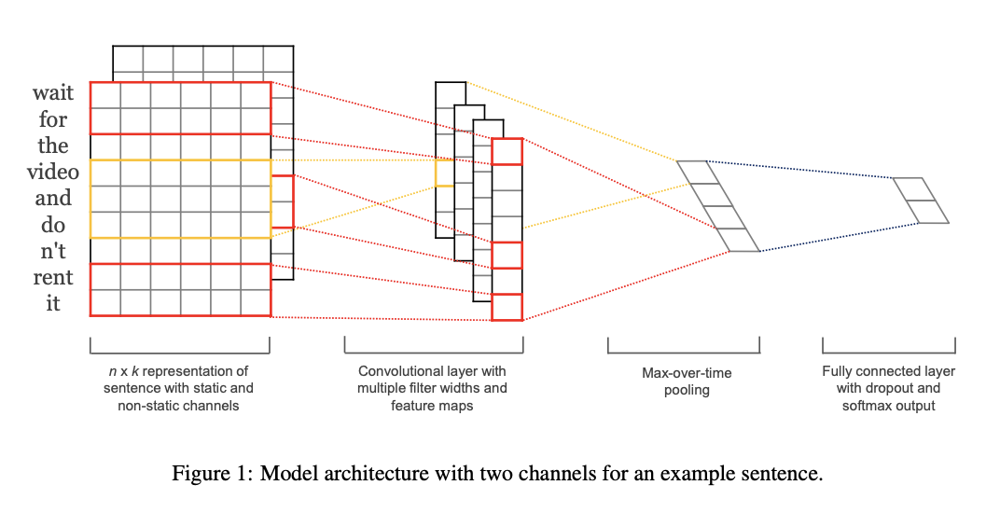
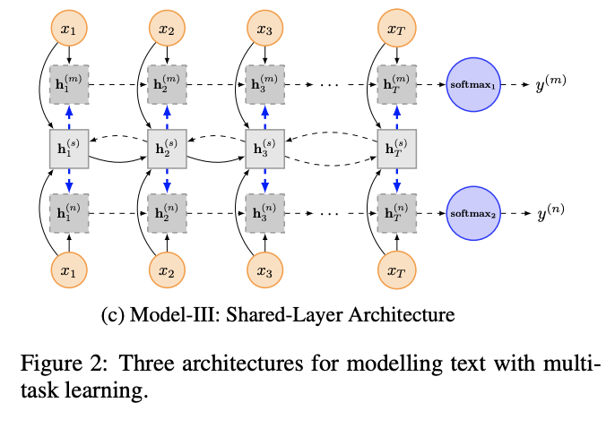

### 文本分类模型

https://github.com/DX2048/text_classification

文本分类经典模型：

1. 《Convolutional Neural Networks for Sentence Classification》

   https://www.aclweb.org/anthology/D14-1181

   TextCNN用于文本分类：似乎是作为卷积神经网络用于文本领域的开山之作，利用卷积操作提取句子的语义信息;

<figure>
	
	<figcaption><a> 卷积->池化->全连接层->softmax->分类 </a>.</figcaption>
</figure>

2. 《A Convolutional Neural Network for Modelling Sentences》

   https://www.aclweb.org/anthology/P14-1062

   该论文也是使用卷积神经网络通过卷积的形式获取句子特征，根据获取的特征进行文本分类等。

   （1）与上文不同的是该论文使用宽卷积进行操作，而上文使用窄卷积，宽窄卷积可以理解成是否对句子的左右进行padding的操作，如果进行了padding，则是宽卷积，否则是窄卷积；

   （2）池化层较第一篇论文也有相应的改进，此处最大池化层使用的是dynamic k-max pooling，上文直接取得最大池化操作；

3. 《Recurrent Neural Network for TextClassififcation with Multi-Task Learning》

   https://www.ijcai.org/Proceedings/16/Papers/408.pdf

   RNN模型在自然语言处理领域因其能够更好的表达上下文信息，可以被看作是文本领域的标配网络架构，该论文直接将最后一个隐层状态的输出结果取softmax的分类结果。此处描述的多任务学习指的是把不同数据集进行联合训练得到分类结果，联合训练的时候共享词嵌入层的信息。
   <figure>
	
   </figure>

   

4. 《Recurrent Convolutional Neural Networks for Text Classification》

   [http://www.nlpr.ia.ac.cn/cip/~liukang/liukangPageFile/Recurrent%20Convolutional%20Neural%20Networks%20for%20Text%20Classification.pdf](http://www.nlpr.ia.ac.cn/cip/~liukang/liukangPageFile/Recurrent Convolutional Neural Networks for Text Classification.pdf)

   RNN可以很好地获取上下文信息，下一个词信息的捕捉依赖于上一个词信息的捕捉，而如果对于较长文本的时候，由于最后一个词与前面一个词的距离可能过长，其获取长期依赖信息的能力会有所下降。为了处理这个问题，卷积神经网络作为无偏模型，可以通过最大池化获取句子的特征信息，对于较长文本可能CNN比起RNN会更优，卷积神经网络提取特征信息的时候，其窗口大小的选择至关重要。

   作者提出的RCNN，首先使用一个双向的RNN结构，可能较传统的window-based网络架构能够更好的捕捉上下文信息从而最大程度的学习句子的表达。而且在一定程度上能够保留句子的顺序信息，然后使用最大池化层自动获取影响分类的关键特征信息。RCNN充分利用了循环神经网络和卷积神经网络的优势。

   文本分类模型的关键在于对句子的特征表达，根据特征表达获取影响分类的关键特征，从而进行分类。

   RCNN作者在获取文本特征的时候同时根据当前单词的左上下文，右上下文以及单词本身来获取当前单词的特征表达，获取词的表示之后通过池化，全连接操作得到文本表示，最后进行softmax分类。

   

5. 《Hierarchical Attention Networks for Document Classification》

   https://www.cs.cmu.edu/~./hovy/papers/16HLT-hierarchical-attention-networks.pdf

   该论文的主要目的是为了对文档分类，文档文本长度都较长，文档由句子组成，句子再由字组成，HAN的网络模型架构第一层为字编码，基于字与字之间的注意力机制获取由字组成的句子信息，再通过获取的句子信息计算句子与句子之间的注意力机制，从而得到文档的编码。由该网络架构我们可以看出其获取特征是逐级别获取的，将获取到的文档编码输入到全连接层，再对全连接层的结果取softmax，得到文档的分类结果。

   

6. 《Bag of Tricks for Efficient Text Classification》

   https://arxiv.org/pdf/1607.01759.pdf

   FastText模型架构与word2vec的CBOW模型相似，FastText预测label，而CBOW预测中间词（基于上下文词汇预测中间词），且加入字符级别的N-gram特征以捕捉词序特征即基于子词信息丰富词汇向量（有利于低频词汇的词向量表示，对训练库外的词仍然可以构建他的词向量）

   FastText与Word2vec的不同之处：

   （1） 输入层：CBOW模型的输入是目标单词的上下文，FastText的输入是多个单词及其n-gram特征；

   （2） 输出层：Word2vec的目的是得到词向量，CBOW的输出是输出目标词汇，FastText的目的是得到输入词序列的label.

   FastText的核心思想就是：将整个句子的词及n-gram向量叠加平均得到句子向量，然后使用句子向量softmax分类.FastText采用了分层softmax，大大降低了模型的训练时间，FastText适用于类别大且数据足够多的情况，对小数据集容易出现过拟合现象.

7. 《Attention pooling-based convolutional neural network for sentence modelling》

   
   
   
   
   论文的主要创新之处在于通过双向LSTM以及卷积操作，Attention Weight等获取句子的表达（类似句子的特征抽取）。
