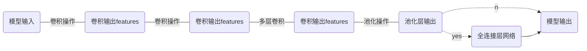

### 卷积神经网络

https://blog.csdn.net/wangyangzhizhou/article/details/76034219

1. 卷积层的作用是对输入数据进行特征提取，在实际的卷积特征过程中，可以设置多个filter size提取不同尺度的信息，如对文本而言，如果将filter size 设置成[2, 3, 4]，在某种程度上可以理解为是对输入的文本进行2-gram，3-gram，4-gram的特征提取。
2. 池化层：池化层的主要目的是降维，常见的池化操作有最大值池化/平均值池化/top_k值池化/分块chunk最大池化策略等。

### 循环神经网络

https://blog.csdn.net/wangyangzhizhou/article/details/76278375

循环神经网络的提出的主要是为了能够处理序列化的数据，卷积神经网络只能获取滑动窗口内的数据信息的相关特征，而对于类似文本这种序列话的数据具有长期依赖性，下文的内容相关信息通俗来讲都会与上文相关。循环神经网络为了处理这种相关性而诞生，在中间状态对前面的输入信息进行记忆，再依次传递到下一个神经元。

循环神经网络的局限性：

（1）通过循环神经网络的建立方式，我们可以发现其输入网络模型的顺序是按序列输入顺序进行输入的，每一个神经单元的输入都依赖于上一个神经单元的输出结果，故其难以进行并行运算；

（2）难以处理较长序列的数据，容易存在梯度消失或者梯度爆炸现象（当梯度小于1的时候，反向传播求幂方，会倾向于0，发生梯度消失；当梯度大于1的时候，反向传播求幂方，会倾向于无穷大，产生梯度爆炸现象）。

### LSTM（长短期记忆网络）

https://blog.csdn.net/wangyangzhizhou/article/details/76651116

LSTM模型是循环神经网络的经典变体，通过改良循环神经网络的特性，让其能够在某种程度上减少梯度消失或者梯度爆炸的现象，且不改变其处理长期序列的能力。

LSTM主要通过三个门机制来决定对数据信息的保留与传递：输入门，遗忘门，输出门。

(1) 输入门：决定多少信息需要保留$$i_t=\sigma(W_i[h_{t-1}; x_t] + b_i)$$;

(2) 遗忘门：决定哪些信息需要被忘记$$f_t=\sigma(W_f[h_{t-1}; x_t] + b_f)$$;

(3) 根据当前的输入信息产生一个新的记忆$$c_{t}^{-}=tanh(W_c[h_{t-1};x_t]+b_c)$$

(4) 通过输入门，遗忘门以及根据当前信息产生的记忆块，获取当前的状态记录到记忆块： $$c_t=f_t * c_{t-1} + i_t * c_t^-$$

(5) 输出门：最终计算需要输出哪些信息$$o_t=\sigma(W_o[h_{t-1};x_t]+b_o)$$

(6)隐状态的输出结果为：$$h_t = o_t * tanh(c_t)$$

### GRU(Gate Recurrent Unit)

https://blog.csdn.net/wangyangzhizhou/article/details/77332582

GRU 作为RNN的另外一个变体，其在某种程度上也改善了RNN梯度消失和梯度爆炸的现象，且其网络架构相较于LSTM较为简单，只有两个门控：更新门和重置门。

（1）重置门：$r_t = \sigma(W_r[h_{t-1};x_t]+b_r)$，决定多少信息需要被遗忘，对应于LSTM的遗忘门；

（2）更新门: $$z_t = \sigma(W_z[h_{t-1};x_t]+b_z)$$，用于控制前一时刻信息带入的程度，值越大说明带入的信息越多，对应于LSTM的输入门；

（3）当前记忆：$$h_t^-=tanh[W_h[r_t * h_{t-1}; x_t] + b_h]$$;

（4）当前隐状态：$$h_t = z_t * h_t^- + (1-z_t) * h_{t-1}$$;

（5）最终输出结果：$$y_t = \sigma(W_o*h_t)$$.

### Seq2Seq(sequence to sequence)模型

Seq2Seq是一种典型的encoder-decoder模型，起初被用于机器翻译模型https://arxiv.org/pdf/1409.3215.pdf，输入翻译的源句子，通过对源句子进行编码再解码的操作，最终得到目标翻译句子。https://arxiv.org/pdf/1409.0473.pdf

经典的RNN模型架构的输入和输出序列是等长的，然而在很多实际问题当中，输入序列和输出序列的句子长度往往是不一致的，例如翻译模型，对于输入数据，输出翻译后的句子长度不一定与输入句子的长度一致，Seq2Seq模型实现了从一个序列到另一个序列的转换，其实现思想是利用两个LSTMs的网络架构，一个作用于输入句子对输入数据进行encoder编码，一个作用于输出，对获取的信息进行解码得到目标输出，可以很好的解决输入输出文本无法对齐的问题。

